---

<table>

<tr>

<td width="38%" valign="top">

# 👋 About Me

### 💻 Software Developer

🎓 B.Tech CSE Student

🌱 Learning **DevOps & Cloud**

🤖 AI Application Builder

⚡ MERN Stack Developer

☕ Java & Spring Boot Enthusiast

🚀 Passionate about building scalable applications

📍 Kolkata, India

---

## ⚡ Quick Facts

- 🔭 Currently working on AI-powered projects
- 🌱 Learning System Design
- 💡 Love solving DSA problems
- 🏆 Open to Software Engineer roles
- ⚡ Always learning something new

</td>

<td width="62%" valign="top">

</td>

</tr>

</table>

---

---

# 🚀 Featured Projects

<table>

<tr>

<td width="50%" valign="top">

<h3 align="center">🏋️ GymForge</h3>

AI-powered fitness companion with JWT authentication, personalized workout generation, progress tracking, daily todo planner and gym wallpaper generator.

</td>

<td width="50%" valign="top">

<h3 align="center">🧠 Resume Checker AI</h3>

ATS Resume Analyzer with AI suggestions, keyword matching, section analysis and resume score generation.

</td>

</tr>

<tr>

<td width="50%" valign="top">

<h3 align="center">🔍 VerifyAI</h3>

AI-powered fake news and misinformation detector using Gemini AI for content verification.

</td>

<td width="50%" valign="top">

<h3 align="center">🌐 Portfolio Website</h3>

Personal developer portfolio featuring projects, skills, certifications, achievements and responsive UI.

</td>

</tr>

</table>

---

# 📊 GitHub Analytics

---

# 📈 GitHub Metrics

---

## 📊 Developer Snapshot

---

## 📌 GitHub Highlights

<table>

<tr>

<td align="center" width="25%">

### 🔥 Consistency

Daily coding and continuous contributions.

</td>

<td align="center" width="25%">

### 🚀 Projects

Building scalable MERN & AI applications.

</td>

<td align="center" width="25%">

### 💡 Learning

Exploring DevOps, Cloud & System Design.

</td>

<td align="center" width="25%">

### 🌍 Open Source

Actively improving personal and collaborative projects.

</td>

</tr>

</table>

---

# 🐍 Coding Journey

<table>

<tr>

<td width="58%" valign="top">

<h2 align="center">🐍 Contribution Snake</h2>

</td>

<td width="42%" valign="top">

<h2 align="center">💻 LeetCode</h2>

</td>

</tr>

</table>

---

---

# 📈 GitHub Activity

---

---

# 🌟 Developer Philosophy

> **"Code is not just about solving problems. It's about creating experiences, learning continuously, and building solutions that make a difference."**

---

# 📌 Current Focus

---

# 📜 Certifications

---

# 📫 Let's Connect

---

# 💬 Quote I Follow

### *"First, solve the problem. Then, write the code."*

— John Johnson

---

### ⭐ Thanks for visiting my profile!

If you like my projects, don't forget to ⭐ them.

 

