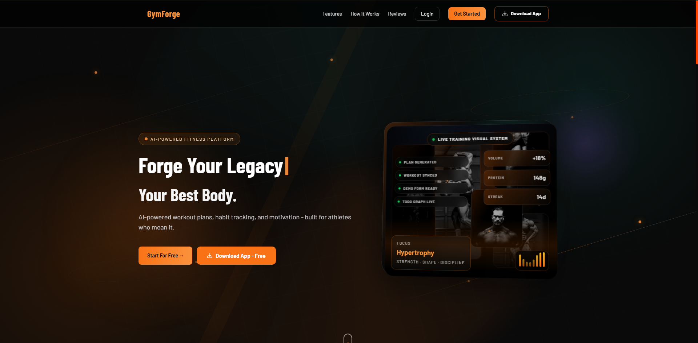
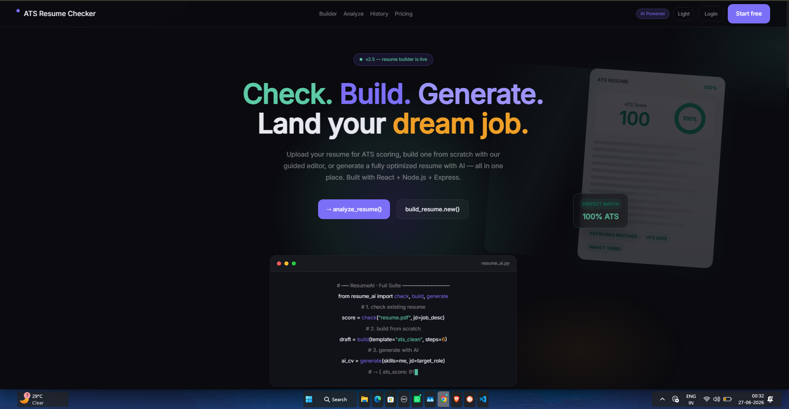
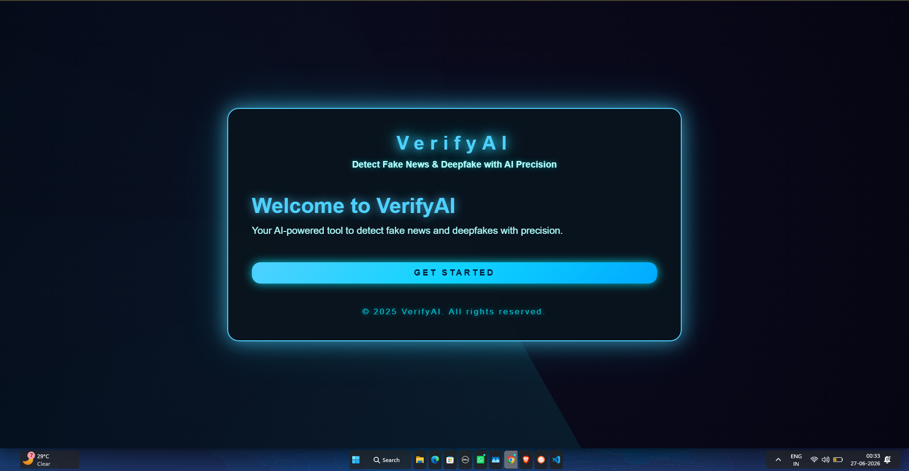
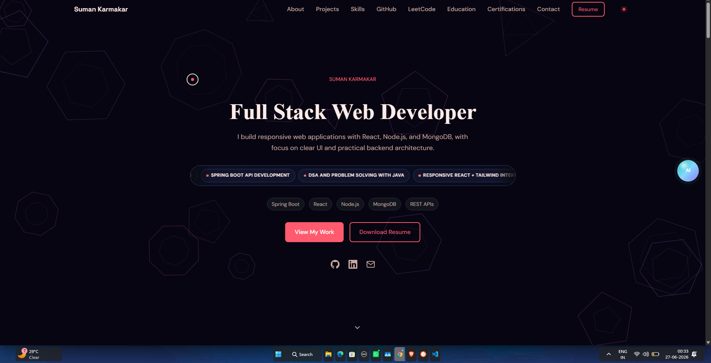
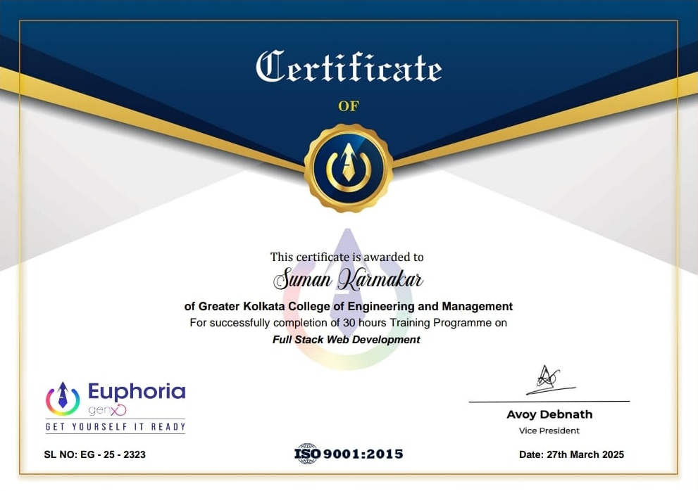
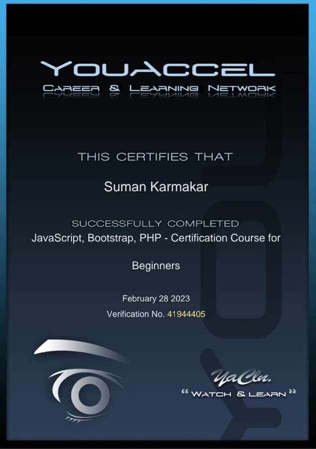
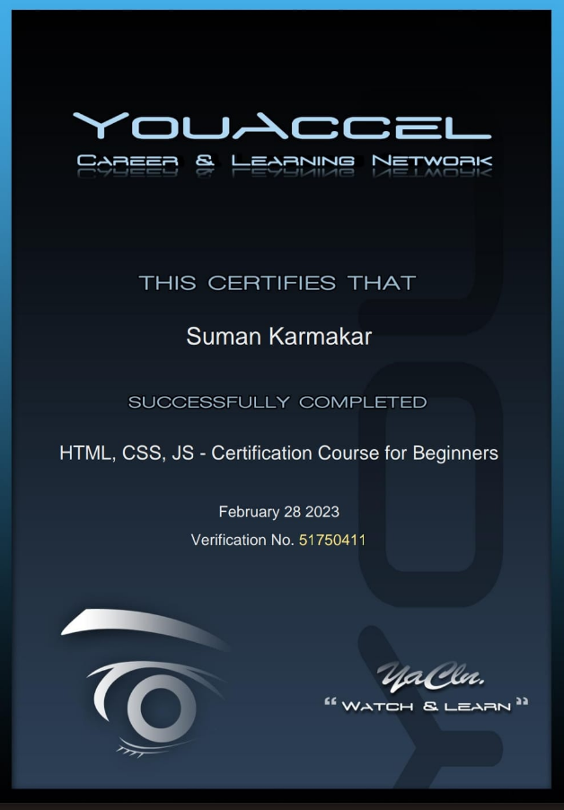
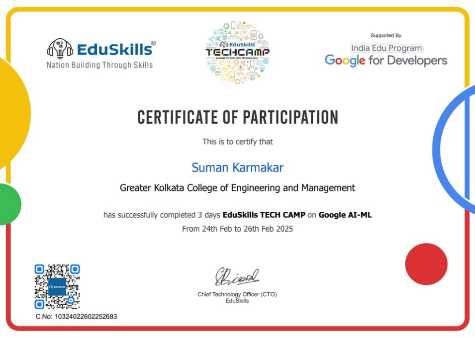

---

# 👋 About Me

<table>

<tr>

<td width="42%" valign="top">

### 💻 Software Developer

🎓 B.Tech CSE Student

🌱 Learning **DevOps & Cloud**

🤖 AI Application Builder

⚡ MERN Stack Developer

☕ DSA with Java

🚀 Passionate about building scalable applications

📍 Kolkata, India

 

## ⚡ Quick Facts

- 🔭 Currently working on AI-powered projects
- 🌱 Learning System Design
- 💡 Love solving DSA problems
- 🏆 Open to Software Engineer roles
- ⚡ Always learning something new

 

## 🛠️ Tech Stack

</td>

<td width="58%" valign="top" align="center">

 

</td>

</tr>

</table>

---

# 🚀 Featured Projects

<table>
<tr>

<td width="50%" valign="top" align="center">

<h3>🏋️ GymForge</h3>

AI-powered fitness platform with personalized workout generation, JWT authentication, progress tracking, todo planner and AI wallpaper generator.

 

</td>

<td width="50%" valign="top" align="center">

<h3>🧠 Resume Checker AI</h3>

ATS Resume Analyzer with AI-powered suggestions, keyword matching, resume scoring and section analysis.

 

</td>

</tr>

<tr>

<td width="50%" valign="top" align="center">

<h3>🔍 VerifyAI</h3>

AI-powered fake news detection platform that verifies headlines and articles using Gemini AI.

 

</td>

<td width="50%" valign="top" align="center">

<h3>🌐 Portfolio Website</h3>

Modern developer portfolio showcasing projects, skills, certifications and achievements with responsive UI.

 

</td>

</tr>

</table>

---

# 📊 GitHub Analytics

---

## 📊 Developer Snapshot

---

## 📌 GitHub Highlights

<table>

<tr>

<td align="center" width="25%">

### 🔥 Consistency

Daily coding and continuous contributions.

</td>

<td align="center" width="25%">

### 🚀 Projects

Building scalable MERN & AI applications.

</td>

<td align="center" width="25%">

### 💡 Learning

Exploring DevOps, Cloud & System Design.

</td>

<td align="center" width="25%">

### 🌍 Open Source

Actively improving personal and collaborative projects.

</td>

</tr>

</table>

---

# 🐍 Coding Journey

<table>

<tr>

<td width="58%" valign="top">

<h2 align="center">🐍 Contribution Snake</h2>

<picture>
<source media="(prefers-color-scheme: dark)" srcset="https://raw.githubusercontent.com/SumanKarmakar467/SumanKarmakar467/output/github-contribution-grid-snake-dark.svg">
<source media="(prefers-color-scheme: light)" srcset="https://raw.githubusercontent.com/SumanKarmakar467/SumanKarmakar467/output/github-contribution-grid-snake.svg">

</picture>

</td>

<td width="42%" valign="top">

<h2 align="center">💻 LeetCode</h2>

</td>

</tr>

</table>

---

# 🌟 Developer Philosophy

> **"Code is not just about solving problems. It's about creating experiences, learning continuously, and building solutions that make a difference."**

---

# 📌 Current Focus

---

# 📜 Certifications

<table>

<tr>

<td align="center" width="25%">

### 🏆 Full Stack Web Development

</td>

<td align="center" width="25%">

### 💻 JavaScript, Bootstrap & PHP

</td>

<td align="center" width="25%">

### 🌐 HTML, CSS & JavaScript

</td>

<td align="center" width="25%">

### 🤖 Google AI-ML Tech Camp

</td>

</tr>

</table>

---

# 📫 Let's Connect

---

# 💬 Quote I Follow

### *"First, solve the problem. Then, write the code."*

— John Johnson

---

### ⭐ Thanks for visiting my profile!

If you like my projects, don't forget to ⭐ them.

 

